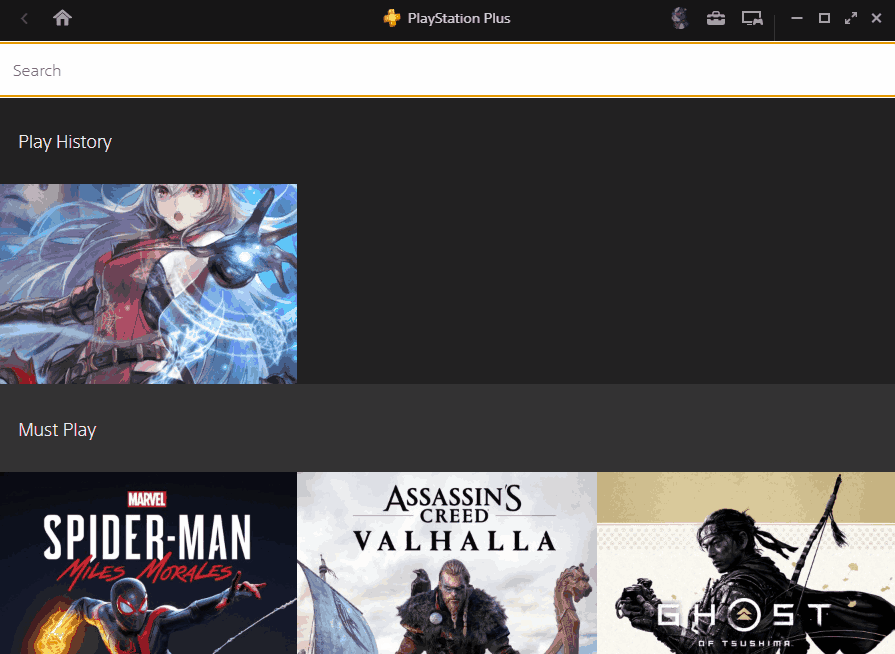

# PSPLUSTilesTheme
A custom theme for the Playstation Plus app with search. Inspured by [this gist](https://gist.github.com/aquelemiguel/170eadf2883d783b24236d249ab28fb9) by aquelemiguel.

The theme introduces the following changes:
* Remove sliders
* Show games as tiles
* Sticky headers for game sections
* Allow to search for games




## Installation
**NOTE**: The installation is manual, and always be. While it is possible to create an installer, the manual installation allows you to see what is being changed.
Review every change you make. There will never be an installer for this to not give anyone the opportunity to inject malicious content.

### Prerequisites
* A recent version of [npm](https://www.npmjs.com/) 

### Unpacking app.asar
Open a terminal as an administrator. Navigate to the resources folder in the launcher installation directory:

```bash
$ cd C:\Program Files (x86)\PlayStationPlus\agl\resources
```

There should be an `app.asar` file in this folder. [`asar`](https://github.com/electron/asar) is an archive format for compressing your Electron app. We need to unpack it to have access to the project's files.

```bash
$ npx asar extract app.asar app
```

This generates an `app` folder in the same directory. Rename the old `app.asar` to `app.asar.bak` to make the launcher prefer the new folder.

### Editing preload_context_isolation.js
Open `app/html/preload_context_isolation.js` in a text editor as an administrator.

Identify this line near the top of the file (should be line 3):
```js
var GKP = function () {
```

Directly underneath it, copy and paste the code from [code.js](code.js)
